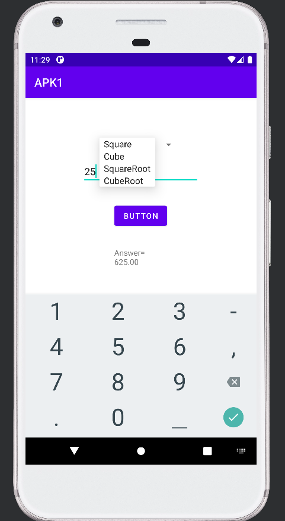
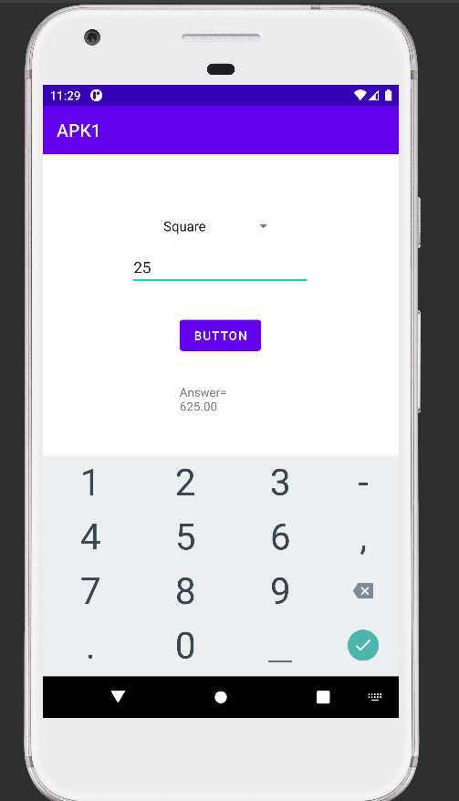
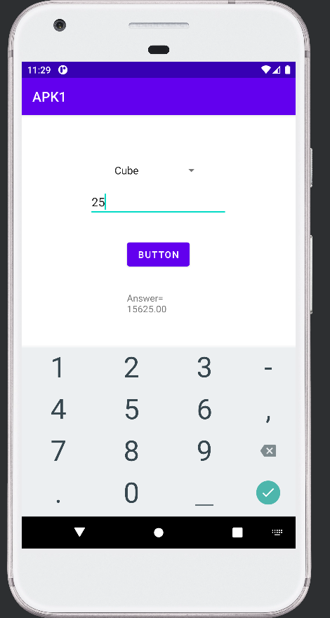
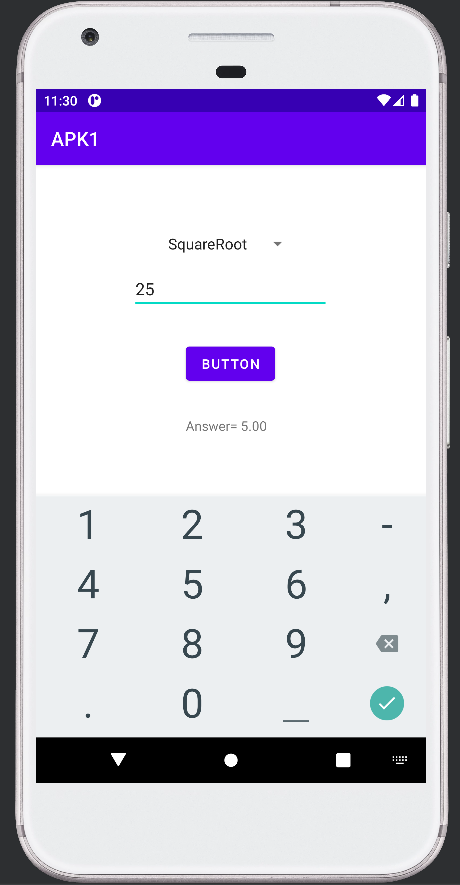
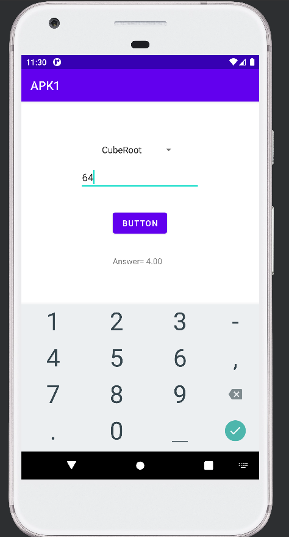

# Android Calculator App (APK1)

This Android application performs basic mathematical calculations including **square, cube, square root, and cube root**.

The project is built using **Java and Android Studio** and demonstrates simple UI interaction and mathematical operations in an Android application.

---

## Purpose

This project was created as a learning exercise to understand how to build a simple **Android calculator application** and implement mathematical computations using Java.

It demonstrates how to:
- Take user input
- Perform mathematical calculations like square,cube,square root,cube root
- Display results in an Android interface

---

## Features

- Calculate square of a number
- Calculate cube of a number
- Calculate square root
- Calculate cube root
- Simple user interface
- Instant result display

---

## Technologies Used

- Java
- Android Studio
- Android SDK
- XML Layouts

---

## Project Structure

Main components of the project:

- `MainActivity.java` → Handles user input and mathematical calculations  
- `activity_main.xml` → Defines the user interface of the calculator  

---

## How the App Works

1. User enters a number.
2. The app performs the selected mathematical operation.
3. The result is displayed on the screen.

Supported operations:

- Square
- Cube
- Square Root
- Cube Root

---

## Screenshots

  
  
  

  
  

---

## Author

Rishi Singh
